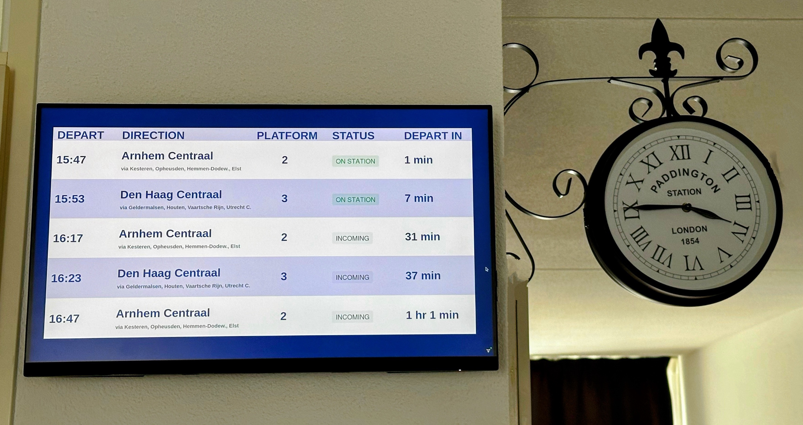

# NS Home Display

## Overview



NS Home Display is an innovative solution designed to enhance your home with real-time display of railway information.
This project aims to provide a convenient and visually appealing way to keep track of the trains departing from your favourite stations.

This project can be used as a starting point to create your own railway display at home using Vaadin with Spring Boot.
It contains all the necessary configuration and some placeholder code to get you started.

## Getting your NS API Keys

To get the live train data, you need to create an account with [NS API Portal](https://apiportal.ns.nl/) and subscribe to the Reisinformatie API.
Update the following property with the API key in the application.properties file:
```
subscriptionKey=<your NS API key>
```

## Prerequisites
- Java 17
- Maven

## Getting Started

### Clone the repository
```
git clone https://github.com/Rijosam/NS-home-display.git
cd NS-home-display
```

### Build and run the application

```
./mvnw clean install
./mvnw spring-boot:run
```
Once the application is successfully run, it starts in your browser at http://localhost:8097/

### Changing the station

By default, the application is set to display information for the Tiel railway station. To customize this setting:

1. Launch the Admin Portal: Navigate to http://localhost:8097/admin in your web browser.
2. Select a Station: Choose a station from the list of preconfigured stations. 
3. Add a New Station: If you need to include a new station in the list, modify the `Station` enum in the codebase to add your desired station.

This setup allows flexibility in tailoring the application to different railway stations as needed.
